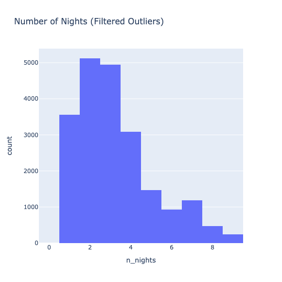

# Airbnb_Analysis

 **North Star Metrics and Key Dimensions:**
===============================

**Booking Conversion Rate-** The percentage of users who proceed from searching and making inquiries to completing a booking.

**Inquiry Conversion Rate-** The percentage of users who, after searching, make an inquiry to a host
Higher inquiry conversion rates suggest that listings are appealing and relevant to users’ needs.

**Guest Group Size:** Understanding the typical group size helps tailor accommodations to meet demand.

**Search Lead Time:** The time between when a user searches for accommodation and their intended check-in date. This dimension helps in optimizing pricing strategies and inventory management.

**Room Type Preference:** The types of accommodations users prefer, which guides hosts in listing and marketing their properties effectively.
Origin Country of Searches: Identifying the geographical origin of searches to tailor marketing strategies and listing content.

**Stay Duration and Check-in Days:** Patterns in the length of stay and preferred check-in days, useful for creating targeted promotions and flexible booking options.

## Summary of Insights
----

## Guest Search Behavior:

Most searches are for 1 or 2 guests, indicating a preference for smaller accommodations.

Users predominantly search for short stays, with a high concentration of searches for weekend check-ins (Friday and Saturday).

75% of users search for accommodations 1-2 months in advance, though there is a significant number of last-minute searches.
Host Inquiries and Booking Patterns:

Over half of users make inquiries after searching, but only about 23.68% convert into bookings.
Conversion rates drop significantly for larger groups, suggesting challenges in finding suitable accommodations.
Faster response times from hosts are correlated with higher booking rates.
Geographical Insights:

The majority of searches come from within Ireland, followed by the United States and the United Kingdom, indicating Dublin's appeal to both local and international travelers.
Recommendations and Next Steps
Recommendations
Optimize Listings for Smaller Groups: Focus on enhancing smaller accommodations, such as studios or one-bedroom apartments, to cater to the predominant market segment of solo travelers and couples.

Cater to Short-Term and Weekend Stays: Offer flexible check-in/out times and weekend packages to attract short-stay travelers. Marketing efforts should highlight Dublin as a top destination for weekend getaways.

Dynamic Pricing Strategies: Implement pricing strategies that reward early bookings while keeping some inventory available for last-minute bookings at premium rates. This can capture both early planners and those looking for immediate stays.

Improve Host Communication: Encourage hosts to respond promptly to inquiries to increase booking conversion rates. Tools that prioritize urgent inquiries or automate initial responses could be beneficial.

Tailored Marketing for Key Origin Countries: Develop targeted marketing campaigns for the top origin countries, particularly focusing on the preferences of travelers from Ireland, the United States, and the United Kingdom.

Address Larger Group Needs: Work on identifying and addressing the specific needs of larger groups, such as clearer descriptions of large group accommodations or special group discounts.

Next Steps
Deeper Analysis of Conversion Barriers: Investigate the specific reasons why many inquiries do not convert into bookings, especially for larger groups. This could involve user surveys or further data analysis.

User Experience Enhancements: Explore ways to improve the user interface and experience, particularly for users making last-minute bookings or searching for large group accommodations.

Expand Geographical Insights: Conduct a comparative analysis of search and booking behaviors in other cities to identify unique market characteristics that could inform Dublin’s strategy.

Monitor and Adjust Dynamic Pricing Models: Continuously monitor the effectiveness of dynamic pricing strategies and adjust them based on real-time data and market conditions.

Future Data Collection: Consider collecting additional data on guest satisfaction and post-stay feedback to better align offerings with guest expectations and further improve booking conversion rates.

